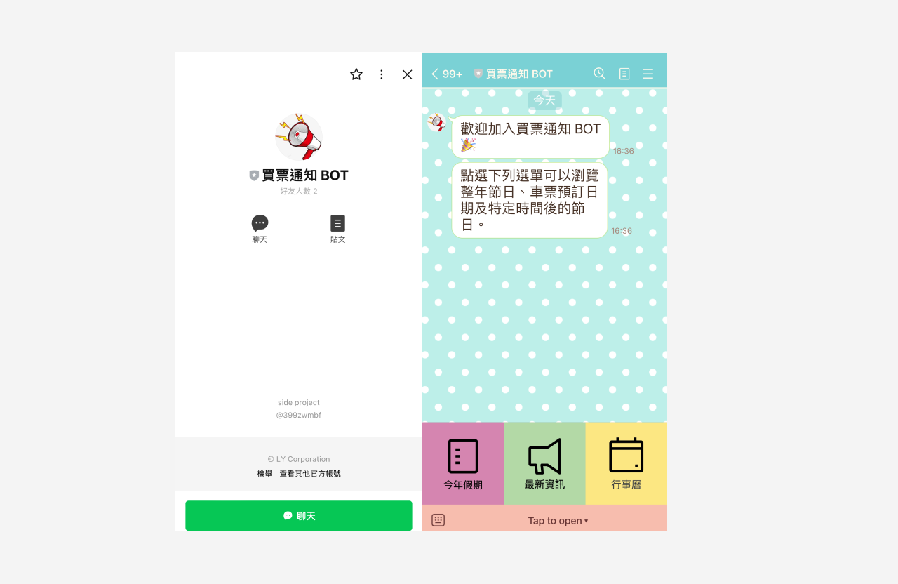

<!--
title: 'AWS NodeJS Example'
description: 'This template demonstrates how to deploy a NodeJS function running on AWS Lambda using the traditional Serverless Framework.'
layout: Doc
framework: v3
platform: AWS
language: nodeJS
priority: 1
authorLink: 'https://github.com/serverless'
authorName: 'Serverless, inc.'
authorAvatar: 'https://avatars1.githubusercontent.com/u/13742415?s=200&v=4'
-->

# Booking Notice Bot

This Line bot provides the ability to browse through holidays throughout the year, check train ticket booking times, and discover holidays around specific dates.
This project built with NodeJS function and deploy to AWS Lambda using the traditional Serverless Framework.

  

## Usage
Scan the QR code below or click [this link](https://lin.ee/JBsVrSv) to add the BOT on your phone.

  

## Built With

## API
- [Taiwan Calender](https://github.com/ruyut/TaiwanCalendar)
- [Line Message Api](https://developers.line.biz/en/reference/messaging-api/)

## Contributor
- [Isis Lin](https://github.com/qweb321)